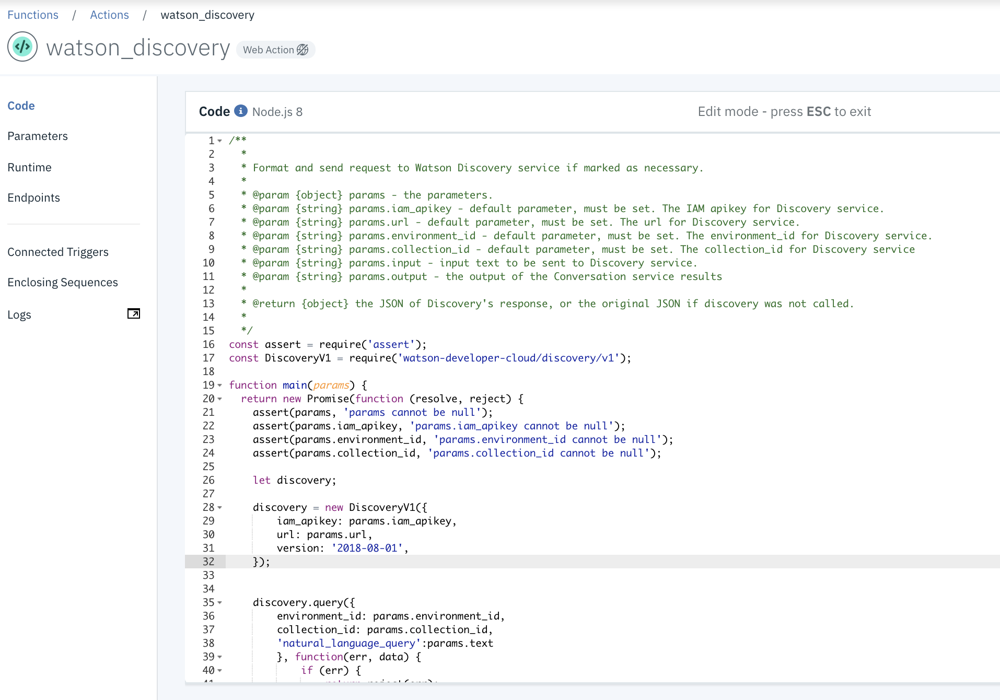
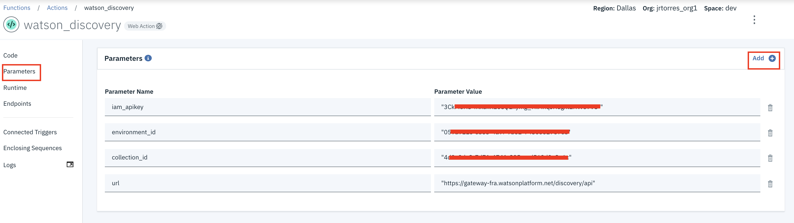
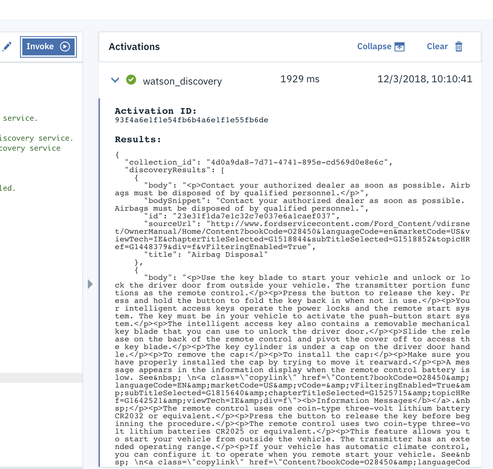
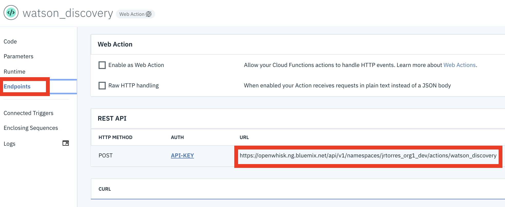

# Watson Assistant with Discovery Lab (Optional): Integrate Discovery Via Cloud Functions

Sign up for an [IBM Cloud account](https://console.cloud.ibm.com). If you already have an account, sign into your account.  

## Step 1: Create a Cloud Function

First we will create a cloud function that will call the Watson Discovery service (WDS). You should have created an WDS service and loaded it with content in a prior lab or receive access details for a pre-created discovery instance separately. This section will assume you have a environment & collection details that can be used by the cloud function.  

1. Click on the **Catalog** link in the top-left corner of the IBM Cloud dashboard.

1. Select the **Compute** category on the left, under 'All Categories'.

1. Select the **Functions** service tile under Serverless Compute.  
   

1. Click on **Actions** link on the left panel and then the **Create** button.  
   

1. Select the **Create Action** option  
   

1. Give your action a Name (i.e `watson_discovery`) and select a Node.js 8 runtime. Then click the **Create** button (note* the action name in the screenshot may be different).  
   

1. Paste the node.js code to call the Discovery service ( copy it from [wds_function.js](functions/wds_function.js)) and click the **Save** button.  
   

1. You now need to add parameters to your action which incude the credentials to access the Discovery service as well as the specific classifier id to invoke. Click on the **Parameters** option from the left panel. Then add parameters as shown below. Be sure to click the **Add** button to add each parameter and ensure you enclose all parameter values in quotes. Make sure to click the **Save** button when you have added the parameters.  
   

1. You can now test your discovery cloud function. Go back to the Code page by clicking on the **Code** link on the left panel. Click on the **Change input** button to supply a question to query the discovery service and then click on the **Apply** button. You can then click on the **Invoke** button and see results pop up on the right **Activations** panel.  

   ```JSON
   {"text":"Tire pressure"}
   ```

   

1. Go ahead and clear the sample input you entered in the step above.  


We now need to gather some details for our cloud function that we will use later in the Watson Assistant (save these details for the next section)  

1. Click on the **Endpoint** option on the left panel. The action name that needs to be saved is at the end of the url:  
   

1. Click on the **API-KEY** link in the REST API section.

1. Click on the eye icon on the right hand side to show your cloud functions API key. Copy and save this value for later  
   

## Step 2: Modify the chatbot

Now lets extend our dialog to cover the out of scope scenario. We will assume that the user has said something that Watson Assistant has classified as out of scope, that user utterance is what we will pass as a natural language query to Watson Discovery.

1. Go to your IBM Cloud console and select your Watson Assistant Service (complete the main part of lab or import the completed workspace file if necessary).

1. Click on the  **Launch tool** button to launch into the Watson Assistant tooling.  
   

1. Click on the **Dialog** tab in the top menu bar. Select the Welcome node and click **Add node**. In the dialog node editor, enter a node name (i.e 'Out of scope'). For the input triggers, have it set to when the intents **#out_of_scope** is identified. Next to the 'Then respond with:' header, click the three vertical button icon and select the **Open JSON editor** option  

1. Copy and Paste the following JSON into the editor:  

   ```JSON
   {
     "output": {
       "generic": []
     },
     "actions": [
       {
         "name": "/jrtorres_org1_dev/actions/watson_discovery",
         "type": "cloud_function",
         "parameters": {
           "text": "<?input.text?>"
         },
         "credentials": "$private.my_credentials",
         "result_variable": "context.watson_discovery_output"
       }
     ]
   }
   ```

   Note that the **'name'** value in the JSON should be updated with the name of your own cloud function (saved from Section 1 above)  

1. Lets add another node to process the results of the discovery call. Select the 'Out of Scope' node you created above and then click the **Add child node** button.  In the dialog node editor, enter a node name 'Display Results'. For the input triggers, have it set to `true`. Next to the 'Then respond with:' header, click the three vertical button icon and select the **Open JSON editor** option. Then replace the contents with the following JSON object (this saves the code and provides the user a response):  

   ```JSON
    {
      "output": {
        "text": {
          "values": [
            "<? $watson_discovery_output ?>"
          ],
          "selection_policy": "sequential"
        }
      }
    }
   }
   ```

1. To link the discovery call and response processing nodes together. Select the 'Out of Scope' node and click the three vertical dots on the node. Select the **Jump to** option and the subsequent **If assistant recognizes (condition)** option.  

1. Before we can test our claim process and classification, we need to provide the API Key to be able to call the Cloud Functions. In a real application, the credentials or key would be passed to Watson Assistant from the client application. For the purposes of this lab, we can put the API key directly in the dialog. We will add the key to the 'Welcome' Node so that it is set up in our context any time a conversation is started with this workspace. **Select the 'Welcome' node** in the dialog tree.

1. Click the three vertical dots next to 'Then respond with:" header and click on **Open context editor**

1. Add a variable name `private` with a value of `{"my_credentials":{"api_key":"REPLACE_WITH_YOUR_API_KEY"}}`. Make sure you actually replace the value 'REPLACE_WITH_YOUR_API_KEY' with your actual api key, saved from section 1 above.  

1. Now you can test the chatbot via the 'Try it out' panel.   

1. **WHEN COMPLETE WITH THIS LAB EXERCISE, REMEMBER TO REMOVE YOUR FUNCTIONS API KEY FROM THE WELCOME NODE.**
