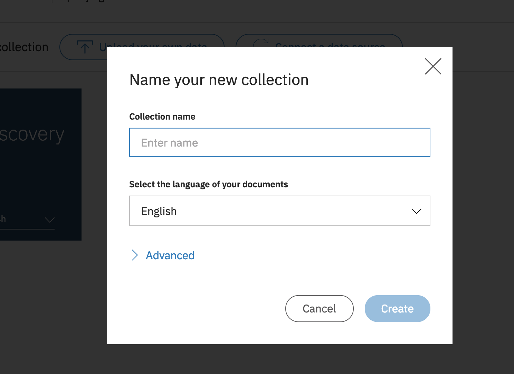
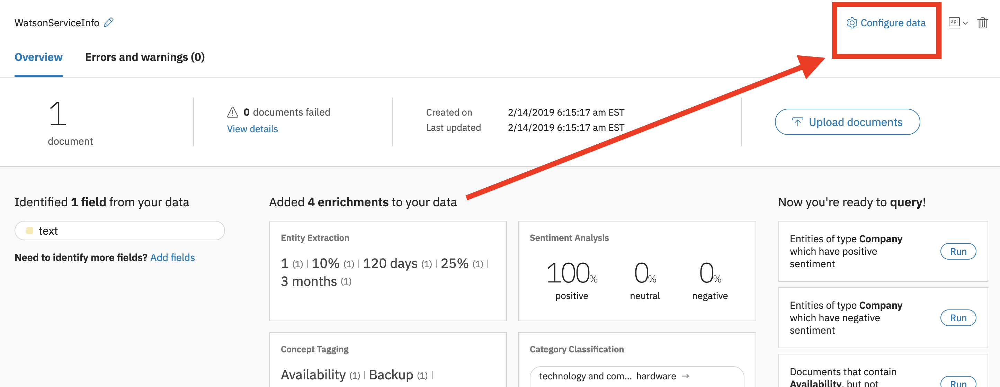
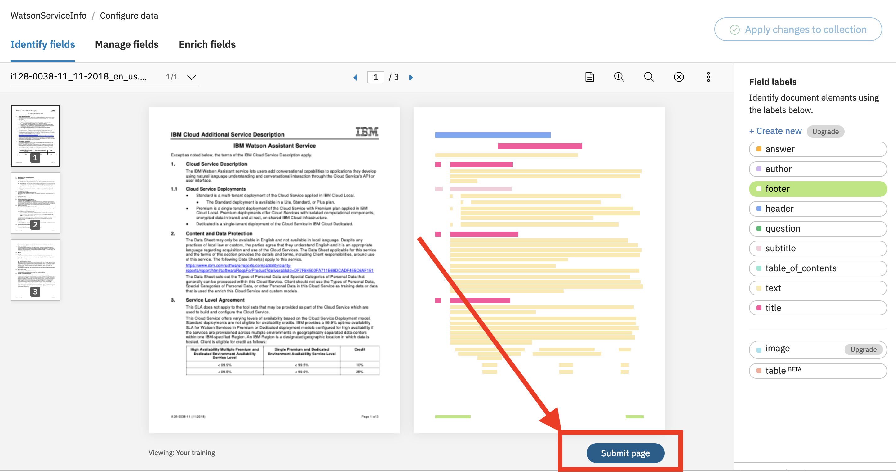
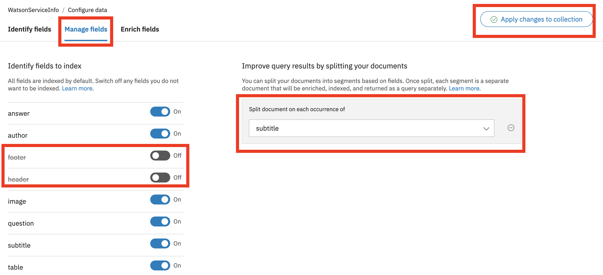
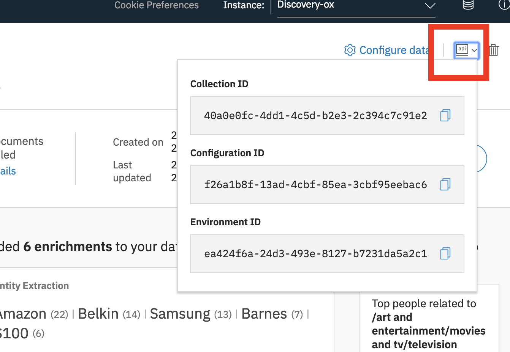

# Overview

IBM Watson Assistant service combines machine learning, natural language understanding, and integrated dialog tools to create conversation flows between your apps and your users. In many cases, building a conversational or questions & answer solution can be accomplished primarily using Watson Assistant. However, there will be scenarios where a question & answer solution can not be modeled using only Watson Assistant, either because the domain is large or the questions are complex. In these scenarios, we can combine Watson Assistant and IBM Watson Disovery service to create a solution. Watson Discovery service enables developers to extract insights from large amounts of structured and unstructured data. Allowing users to unlock hidden value in data, to find answers, monitor trends and surface patterns. In these solutions, Watson Assistant provides reasoning strategies that focus on the language and context of the question to answer simple questions, while Watson Discovery provides reasoning strategies that focus on identifying the most appropriate answer for complex questions using the context of the entire corpus.

In this lab, you will import and modify a Watson Assistant skill, upload content to a Watson Discovery instance, and then integrate the two components using a node.js application.

This application is based on the [Watson Assistant Simple application](https://github.com/watson-developer-cloud/assistant-simple)

## Flow

1. User sends messages to the application (running locally or on IBM Cloud).
2. The application sends the user message to IBM Watson Assistant service, and displays the ongoing chat in a web page.
3. When triggered by the dialog, the application will send some user messages to IBM Watson Discovery to retrieve passage results from a knowledge base.

   

## Featured Technologies

* [IBM Watson Assistant](https://www.ibm.com/watson/developercloud/conversation.html): Build, test and deploy a bot or virtual agent across mobile devices, messaging platforms, or even on a physical robot.
* [IBM Watson Discovery](https://www.ibm.com/watson/services/discovery-3/): Unlock hidden value in data to find answers, monitor trends and surface patterns with the world’s most advanced cloud-native insight engine.
* [Node.js](https://nodejs.org/): An asynchronous event driven JavaScript runtime, designed to build scalable applications.

## Steps

Starting with Watson Assistant

1. Create an instance of the Watson Assistant Service
1. Import the pre-built dialog skill / workspace.

Then adding Discovery

1. Create an  instance of the Watson Discovery Service
1. Import the knowledge base content.
1. Run the Node.js application to test.

## Prerequisites

* Sign up for an [IBM Cloud account](https://console.bluemix.net). 

* Create a directory, open a terminal (bash on Mac, Linux, PowerShell on Windows) and change into this directory.

* Download this repository (either as a Zip file directly from the GitHub page or Clone the project) into this directory. 

   If you have git installed, run the folowing command:
   `git clone https://github.com/jrtorres/assistant-with-discovery-lab.git`

   If you have and prefer to use docker, run the following command:
   `docker run -ti --rm -v "$(pwd):/git" alpine/git clone https://github.com/jrtorres/assistant-with-discovery-lab.git`

# Configure Watson Assistant

Training a chatbot is like training a human agent. You will train the chatbot with the knowledge of certain tasks (intents) and things that these tasks interact with (entities). These components are then combined to create a dialog tree that can take one or more paths to respond to the user's request. In the following steps, we import a previously created dialog skill that helps users interact with a cognitive car dashboard.

1. Go to the IBM Cloud Console - (https://console.bluemix.net) and log in.

1. **Click on the Catalog*** link in the top-left corner of the IBM Cloud dashboard.

1. **Select the AI category** on the left, under 'All Categories'.

1. **Select the Watson Assistant** service tile.  

    

1. Click **Create** (*Leave default options for Lite plan, region service name, etc*).

1. Click on the  **Launch tool** button to launch into the Watson Assistant tooling.  

    

1. This is the Watson Assistant tooling where you can create assistants, skills and and setup different chatbots applications. We'll be importing a pre-built skill. **Click on 'Skills'** on the top left, and then on the **Create new** button. 

    

1. **Click on 'Import Skill'** and then on the **Choose JSON File** button. 

    

1. Find the workspace [JSON file](data/assistant_skills/skill-IT-Support-bot.json) downloaded from this repository on your local machine, in the data/assistant_skills directory and **Click the 'Import'** button (make sure the **Everything** radio button is selected to import intents, entities and dialog).  

    

1. You will be redirected into a page with four tabs, Intents, Entities, Dialog, and Content Catalog. For the purposes of this lab, the skill is fairly complete.

# Configure Watson Discovery

The user's questions/requests may at times be relevant but out of scope for the Watson Assistant (or not practical to resolve with only Watson Assistant). These are questions that may not be frequently asked, may have multiple answers, or whose answers might exist in a knowledge base. In these cases, combining Watson Assistant and the information retrieval capabilities of Watson Discovery can be used to provide the answers to the user. 

Within Watson Discovery, we are going to add content that can be used to address some of the user questions that are out of scope for the Watson Assistant. In order to do this we will set up a collection and index a set of provided documents.

1. Go to the IBM Cloud Console - (https://console.bluemix.net) and log in.

1. **Click on the Catalog** link in the top-left corner of the IBM Cloud dashboard.

1. **Select the AI category** on the left, under 'All Categories'.

1. **Select the Watson Discovery** service tile.  

    

1. Click **Create** (*Leave default options for Lite plan, region service name, etc*)

1. Click on the  **Launch tool** button to launch into the Watson Discovery tooling.  

    

1. On the landing page, you have the option to use pre-enriched and ingested content that comes out of the box with discovery (news related content source) or to add your own content. **Click the 'Upload your own data'** button on the top left of the page.  If you are presented with a message about Lite Plan being for trial & experimentation, go ahead and click on 'Set up with current plan' and click 'Continue'. This message is to inform you that Lite plans are not intended for production usage scenarios. At this point, the environment and back end resources are being set up for your content.  

    

1. In the collection details dialog window, give your collection a name (i.e 'Search Data') and **click the Create** button.
   

1. In the center of the collection landing page, select **or browse from computer** link to start uploading content. Select one of the documents provided in this repository under the `data/discovery_content/service_info/` folder.

1. Once the document completes uploading (*Note: This may take a couple of minutes*), you should see the collection information page show one document in the collection. Click on the **`Configure data`** option on the top right.
   

1. In the `Identify Fields` panel, you are going to annotate the document with labels. Select a label from the 'Field labels' panel and then highlight the text that the label represents. For example, select the `header` labe land then highlight the topmost piece of text. Annotate as many labels as represented in the text, then click the **Submit page** button.
   

1. Continue to annotate. You should see the model steadily improve as you are annotating.

1. When ready, select the `Manage fields` tab. In this page: 
   * turn off the indexing of the footer and header.
   * Turn on doucment splitting on the subtitle
   * Click the `Apply changes to collection` button. You will be prompted to reimport the document you just annotated.
   

1. Upload the rest of the content.

1. You may need to iterate through the annotation process to improve performance.


# Run the Node.js Application

We can run the node.js sample application locally to provide our interface that calls Watson Assistant & Watson Discovery. Before we can start the application, we will need to gather some information to connect to the services. You are running the application you downloaded or cloned locally, so all terminal commands assume you are in the main working directory.

1. Using a text editor make a copy of the `.env.example` file from the main working directory and call it `.env` (note the leading dot).

1. To find the Watson Assistant service credentials: from the IBM cloud console, click on the Watson Assistant service instance you created and click on **Service credentials** on the left of the page and then the 'View credentials' drop down. You will need the two fields 'apikey' and 'url'
   

1. Add the service credentials that you obtained for the Watson Assistant service in the `.env` file. The Watson SDK automatically locates the correct environment variables for the `apikey` and `url` credentials.

   ```
   ASSISTANT_IAM_APIKEY=caXXXXXXXXXXXXXXXXX
   ASSISTANT_URL=https://gateway.watsonplatform.net/assistant/api
   ```

    Save the `.env` file

1. To interact with the correct skill, you will also need the unique identifier for your skill.  You can find the workspace ID from the Watson Assistant tooling. From the main Skills page, **Click on the three stacked dots** on the top right of the skill you created/imported. Then **click on the 'View API Details'** option in the menu.

      

    Copy the **Workspace ID** value from this page and add the id to the `WORKSPACE_ID` property in the .env file:

    ```
    WORKSPACE_ID=522XXXXXXXXXXXXXXXXXX
    ```

1. To find the Watson Discovery service credentials: from the IBM cloud console, click on the Watson Discovery service instance you created and click on **Service credentials** on the left of the page and then the 'View credentials' drop down. You will need to copy the two fields 'apikey' and 'url' into the `.env` file. The Watson SDK automatically locates the correct environment variables for the `apikey` and `url` credentials.

    ```
    DISCOVERY_IAM_APIKEY=caXXXXXXXXXXXXXXXXX
    DISCOVERY_URL=https://gateway.watsonplatform.net/assistant/api
    ```

    Save the `.env` file

1. To interact with the collection we created, you will need to gather a couple of unique identifiers (an environment ID and a collection ID).  You can find these IDs from the Watson Discovery tooling. From the desired collection landing page, Click on the **`Api`** drop down on the top right of the screen. Copy and Save the **Collection Id** and the **Environment Id**
   

    Copy the **Collection Id** and **Environment Id** value from this page and add the ids to the .env file as shown:

    ```
    DISCOVERY_COLLECTION_ID=4d0aXXXXXXXXXXXXXXXXXXX
    DISCOVERY_ENVIRONMENT_ID=059XXXXXXXXXXXXXXXXXXX
    ```

    Save the `.env` file

1. Install the applications dependencies by running the following command:

    ```
    npm install
    ```

1. Start the application using the following command:

    ```
    npm start
    ```

1. View the application in a browser at `localhost:3000` and interact with the chatbot.

## [OPTIONAL] Call Discovery with Cloud Functions

Another approach to integrate the Watson Discovery service is to use cloud functions allowing the Watson Assistant dialog to call Watson Discovery directly (instead of the client application). As an optional exercise, run the steps in the [Discovery Cloud Functions Readme](DiscoveryCloudFunction.md).

# License

This sample code is licensed under Apache 2.0.  
Full license text is available in [LICENSE](LICENSE).

# Links

* [IBM Watson Assistant Docs](https://console.bluemix.net/docs/services/conversation/dialog-build.html#dialog-build)
* [Blog for IBM Watson Assistant Slots Code Pattern](https://developer.ibm.com/code/2017/09/19/managing-resources-efficiently-watson-conversation-slots/)
* [Tutorial - Deploy a chatbot on IBM Cloud Kubernetes](https://developer.ibm.com/tutorials/set-up-your-own-instance-of-a-chatbot-and-deploy-it-to-the-kubernetes-environment-on-ibm-cloud/?social_post=1872588192&fst=Learn)

# Learn more

* **Artificial Intelligence Code Patterns**: Enjoyed this Code Pattern? Check out our other [AI Code Patterns](https://developer.ibm.com/code/technologies/artificial-intelligence/).
* **AI and Data Code Pattern Playlist**: Bookmark our [playlist](https://www.youtube.com/playlist?list=PLzUbsvIyrNfknNewObx5N7uGZ5FKH0Fde) with all of our Code Pattern videos
* **With Watson**: Want to take your Watson app to the next level? Looking to utilize Watson Brand assets? [Join the With Watson program](https://www.ibm.com/watson/with-watson/) to leverage exclusive brand, marketing, and tech resources to amplify and accelerate your Watson embedded commercial solution.
* **Kubernetes on IBM Cloud**: Deliver your apps with the combined the power of [Kubernetes and Docker on IBM Cloud](https://www.ibm.com/cloud-computing/bluemix/containers)
