# Overview

IBM Watson Assistant service combines machine learning, natural language understanding, and integrated dialog tools to create conversation flows between your apps and your users. In many cases, building a conversational or questions & answer solution can be accomplished primarily using Watson Assistant. However, there will be scenarios where a question & answer solution can not be modeled using only Watson Assistant, either because the domain is large or the questions are complex. In these scenarios, we can combine Watson Assistant and IBM Watson Disovery service to create a solution. Watson Discovery service enables developers to extract insights from large amounts of structured and unstructured data. Allowing users to unlock hidden value in data, to find answers, monitor trends and surface patterns. In these solutions, Watson Assistant provides reasoning strategies that focus on the language and context of the question to answer simple questions, while Watson Discovery provides reasoning strategies that focus on identifying the most appropriate answer for complex questions using the context of the entire corpus.

In this lab, you will import and modify a Watson Assistant skill, upload content to a Watson Discovery instance, and then integrate the two components using a node.js application.

This application is based on the [Watson Assistant Simple application](https://github.com/watson-developer-cloud/assistant-simple)

## Flow

1. User sends messages to the application (running locally or on IBM Cloud).
2. The application sends the user message to IBM Watson Assistant service, and displays the ongoing chat in a web page.
3. When triggered by the dialog, the application will send some user messages to IBM Watson Discovery to retrieve passage results from a knowledge base.

   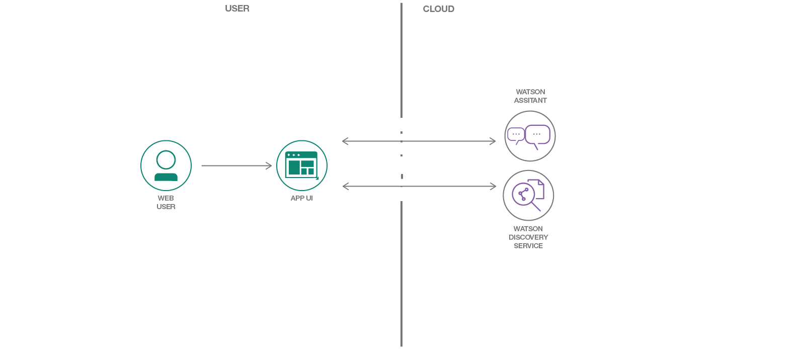

## Featured Technologies

* [IBM Watson Assistant](https://www.ibm.com/watson/developercloud/conversation.html): Build, test and deploy a bot or virtual agent across mobile devices, messaging platforms, or even on a physical robot.
* [IBM Watson Discovery](https://www.ibm.com/watson/services/discovery-3/): Unlock hidden value in data to find answers, monitor trends and surface patterns with the world’s most advanced cloud-native insight engine.
* [Node.js](https://nodejs.org/): An asynchronous event driven JavaScript runtime, designed to build scalable applications.

## Steps

Starting with Watson Assistant
1. Create an instance of the Watson Assistant Service
1. Import the pre-built dialog skill / workspace.
1. Run the Node.js application to test

Then adding Discovery
1. Add an action in the dialog.
1. Create an  instance of the Watson Discovery Service
1. Import the knowledge base content.
1. Add Node.js code to call Watson Discovery
1. Run the Node.js application to test.

## Prerequisites

*  Sign up for an [IBM Cloud account](https://console.bluemix.net). 

*  Create a directory, open a terminal (bash on Mac, Linux, PowerShell on Windows) and change into this directory.

*  Download this repository (either as a Zip file directly from the GitHub page or Clone the project) into this directory. 

   If you have git installed, run the folowing command:
   `git clone https://github.com/jrtorres/assistant-with-discovery-lab.git`

   If you have and prefer to use docker, run the following command:
   `docker run -ti --rm -v "$(pwd):/git" alpine/git clone https://github.com/jrtorres/assistant-with-discovery-lab.git`

# Configure Watson Assistant

## Part 1: Import Basic Bot

Training a chatbot is like training a human agent. You will train the chatbot with the knowledge of certain tasks (intents) and things that these tasks interact with (entities). These components are then combined to create a dialog tree that can take one or more paths to respond to the user's request. In the following steps, we import a previously created dialog skill that helps users interact with a cognitive car dashboard.

1. Go to the IBM Cloud Console - (https://console.bluemix.net) and log in.

1.  **Click on the Catalog*** link in the top-left corner of the IBM Cloud dashboard.

1.  **Select the AI category** on the left, under 'All Categories'.

1.  **Select the Watson Assistant** service tile.  

    

1.  Click **Create** (*Leave default options for Lite plan, region service name, etc*).

1.  Click on the  **Launch tool** button to launch into the Watson Assistant tooling.  

    

1.  This is the Watson Assistant tooling where you can create assistants, skills and and setup different chatbots applications. We'll be importing a pre-built skill. **Click on 'Skills'** on the top left, and then on the **Create new** button. 

    

1.  **Click on 'Import Skill'** and then on the **Choose JSON File** button. 

    

1.  Find the workspace [JSON file](data/assistant_skills/car_dashboard_base.json) downloaded from this repository on your local machine and **Click the 'Import'** button (make sure the **Everything** radio button is selected to import intents, entities and dialog).  

    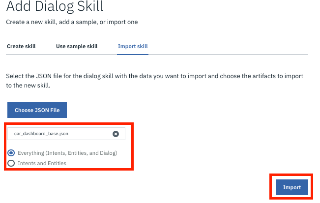

1.  You will be redirected into a page with four tabs, Intents, Entities, Dialog, and Content Catalog. For the purposes of this lab, the skill is fairly complete.

1.  Go ahead and test the chatbot as it is. Click on the **Try it** button on the top right of the page. *If there is a purple banner on the Try It Out panel, you will have to wait until training is completed*.  Enter some text in the panel to interact with the assistant (i.e 'Play some music').  

    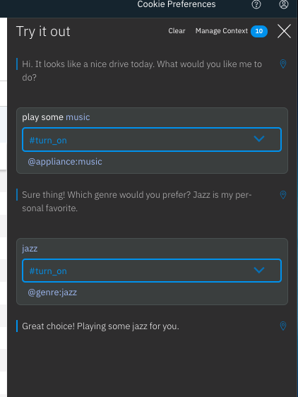

1. The Watson Assistant we have built is useful in answering many users requests/questions such as turning on the music. However, there are some requests that will be out of scope for Watson Assistant. Try asking "checking tire pressure". 

      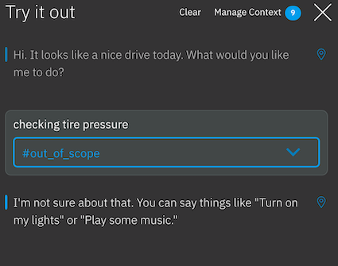

We will use Watson Discovery to handle these out-of-scope requests later in this lab.


## Part 2: Test with the Node.js Application
## Run locally

We can run the node.js sample application locally to provide our interface that calls Watson Assistant & Watson Discovery. Before we can start the application, we will need to gather some information to connect to the services. You are running the application you downloaded or cloned locally, so all terminal commands assume you are in the main working directory.

### Add IBM Cloud service credentials and IDs to .env file

1.  As you create IBM Cloud services, you'll need to use the service credentials to interact with these services. 

1.  Using a text editor make a copy of the `.env.example` file from the main working directory and call it `.env` (note the leading dot).

1.  To find the Watson Assistant service credentials: from the IBM cloud console, click on the Watson Assistant service instance you created and click on **Service credentials** on the left of the page and then the 'View credentials' drop down. You will need the two fields 'apikey' and 'url'

      

1.  Add the service credentials that you obtained for the Watson Assistant service in the `.env` file. The Watson SDK automatically locates the correct environment variables for the `apikey` and `url` credentials.

    ```
    ASSISTANT_IAM_APIKEY=caXXXXXXXXXXXXXXXXX
    ASSISTANT_URL=https://gateway.watsonplatform.net/assistant/api
    ```

    Save the `.env` file

1.  To interact with the correct skill, you will also need the unique identifier for your skill.  You can find the workspace ID from the Watson Assistant tooling. From the main Skills page, **Click on the three stacked dots** on the top right of the skill you created/imported. Then **click on the 'View API Details'** option in the menu.

    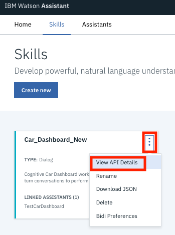  

    Copy the **Workspace ID** value from this page and add the id to the `WORKSPACE_ID` property in the .env file:

    ```
    WORKSPACE_ID=522XXXXXXXXXXXXXXXXXX
    ```

Ignore the `DISCOVERY*` entries in the `.env` file for now, we will add those later.

### Start the application


1.  Install the applications node dependencies by running the following command:

    ```
    npm install
    ```

1.  Start the application using the following command:

    ```
    npm start
    ```

**Optionally**, if you do not have node installed and/or prefer to use docker. Use the following command to start a developer container with the bash prompt and then change the directory in the container into the repository.

1.  Open a terminal and navigate to the `assistant-with-discovery-lab` directory. 

    ```bash
    docker run -it --rm -v "$(pwd):/repo" -p 3000:3000 timrodocker/mydev bash
    cd repo
    ```

### Test the application
1.  View the application in a browser at `localhost:3000` and interact with the chatbot. Try asking the same questions as you did early such as "play some music" or "checking tire pressure".

      
    
# Adding Watson Discovery

The user's questions/requests may at times be relevant but out of scope for the Watson Assistant (or not practical to resolve with only Watson Assistant). These are questions that may not be frequently asked, may have multiple answers, or whose answers might exist in a knowledge base. In these cases, combining Watson Assistant and the information retrieval capabilities of Watson Discovery can be used to provide the answers to the user. 


## Part 1: Add Client Action Flag To Dialog

In this section, we will modify our Watson Assistant skill to handle out of scope questions by triggering the orchestrating application to call the Watson Discovery service. For the purpose of this lab, we have already provided an intent with sample questions that are out of scope, so we will just modify the Dialog to create a client action flag.

1.  **Select the Car_Dashboard_New Skill** and **Click on the Dialog tab** in the top menu bar.

1.  **Click on the 'Add node'** button. This should add a new dialog node near the bottom of the dialog tree and open the dialog node editor. In the dialog node editor, enter a node name (i.e. 'Out of Scope'). For the input triggers, have it set to the intent  **#out_of_scope** (make sure to include the # symbol). 

    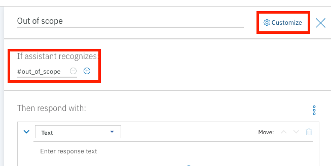

1.  Then click the **Customize** link next to the name and enable Multipe responses for the node and click the **Apply** button.  

    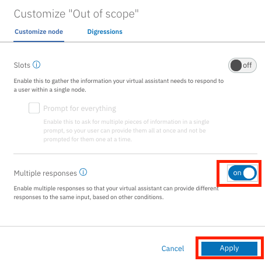

1.  We are only going to set the client side action (i.e the flag to call Watson Discovery) when Watson Assistant is confident it has received an out of scope question from the user. To accomplish this, we will have one response for questions that are out of scope but are under a specific confidence threshold and another with the action flag when above the confidence threshold. In the dialog node editor, for the first response, under the 'If assistant recognizes' column, enter: `intents[0].confidence<0.51` and under the "Respond with" column, enter: `Sorry I haven't learned answers to questions like this.`. This is the response the Watson assistant will use if the intent (#out_of_scope in this case ) is the top one identified with a confidence less than 50%.  

    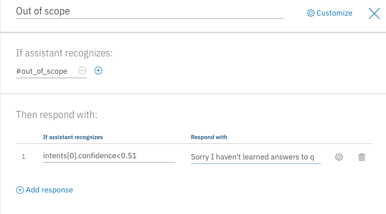

1.  To add our second response field **Click the 'Add response'** link.

      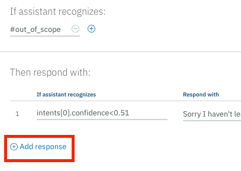

1.  In the dialog node editor, for the second response, under the 'If assistant recognizes' column, enter: `intents[0].confidence>0.5`. Instead of entering a text response, we need to set the action flag. **Click on the gear icon** on the right side of the response field.  

    

1.  In the response configuration window. **Click on the three stacked dot** icon on the right side and select the 'Open JSON editor' option from the menu.

    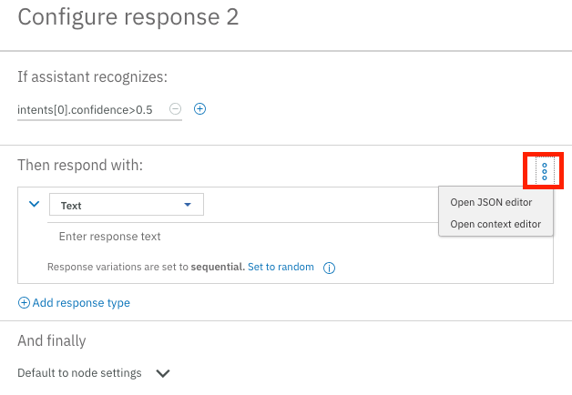

1.  Replace the contents in the window with the following JSON object. This snippet is setting a flag called 'call_discovery' in the output section of the JSON response from Watson Assistant, which our application will look for to know when a call to Watson Discovery is necessary:  
     ```JSON
     {
     "output": {
        "text": {
           "values": [
              "That question is out of scope for this application, take a look at the Watson Assistant Enhanced application to handle questions like these."
           ],
        "selection_policy": "sequential"
        },
        "action": {
           "call_discovery": ""
        }
     }
    }
     ```

1.  **Click on the Save** button.  

    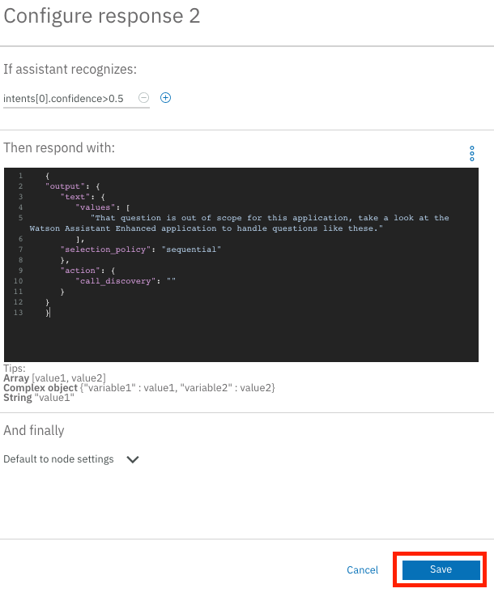

1.  Your dialog node should look as follows:  

    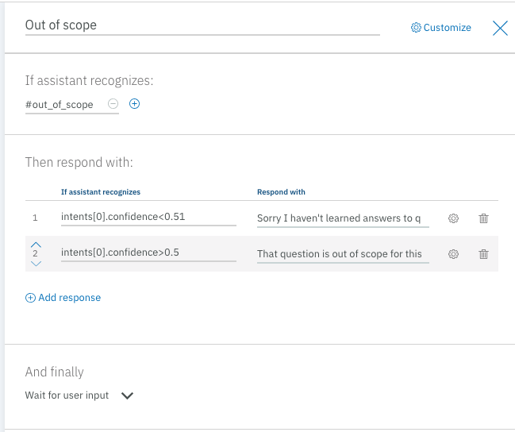

1.  Use the 'Try it out' panel to test your Watson Assistant chat bot. Click on the **Try it** icon in the top-right corner of the tooling. Try asking "checking tire pressure" for example.

    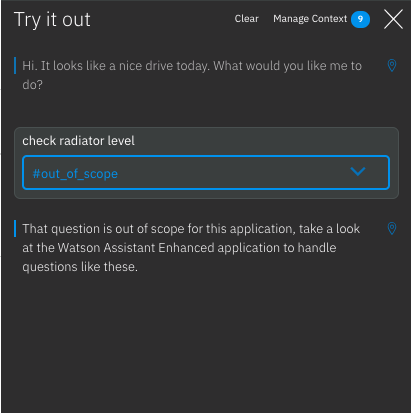


## Part 2: Configure Watson Discovery

Within Watson Discovery, we are going to add content that can be used to address some of the user questions that are out of scope for the Watson Assistant. In order to do this we will set up a collection and index a set of provided documents.

1.  Go to the IBM Cloud Console - (https://console.bluemix.net) and log in.

1.  **Click on the Catalog** link in the top-left corner of the IBM Cloud dashboard.

1.  **Select the AI category** on the left, under 'All Categories'.

1.  **Select the Watson Discovery** service tile.  

    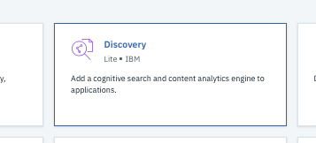

1.  Click **Create** (*Leave default options for Lite plan, region service name, etc*)

1.  Click on the  **Launch tool** button to launch into the Watson Discovery tooling.  

    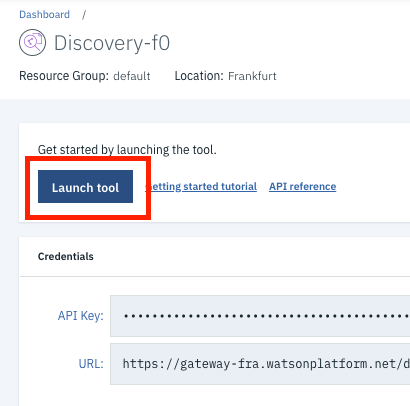

1.  On the landing page, you have the option to use pre-enriched and ingested content that comes out of the box with discovery (news related content source) or to add your own content. **Click the 'Upload your own data'** button on the top left of the page.  If you are presented with a message about Lite Plan being for trial & experimentation, go ahead and click on 'Set up with current plan' and click 'Continue'. This message is to inform you that Lite plans are not intended for production usage scenarios. At this point, the environment and back end resources are being set up for your content.  

    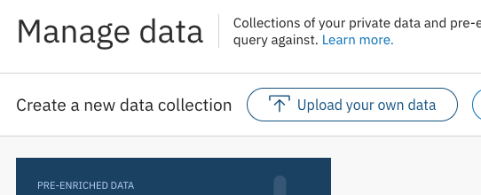

1.  In the collection details dialog window, give your collection a name (i.e 'LongTailContent') and **click the Create** button. You will use the default configuration for this lab. In other scenarios, you might create a custom configuration that defines how content is converted, how it is enriched and any other processing before it is indexed. The content we will be uploading is already in JSON format and we are not going to be using the enrichments, so the default configuration will work well for this use case.  

    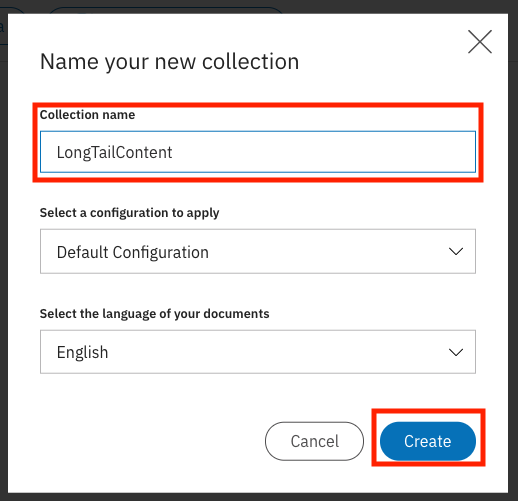

1.   In the center of the collection landing page, select **or browse from computer** link to start uploading content.  

      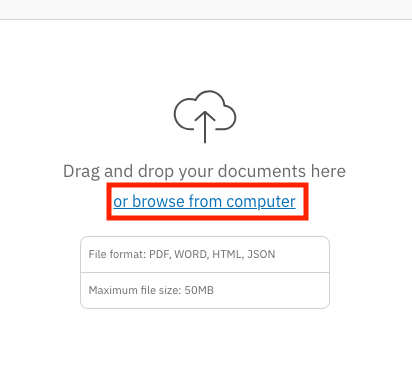

1.   For the purpose of this lab, we have provided a set of documents already in JSON format that are in the data/discovery_content directory of the repository. From the file section dialog, find the directory with these files and select all the JSON files and **click on the 'Open'** button.  

      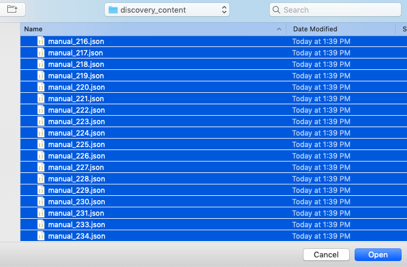

1.   As the content is uploading, you should be taken back to the collection landing page. There should be no errors indicated on the landing page and an indicator next to the document count to show that content is still processing. 

      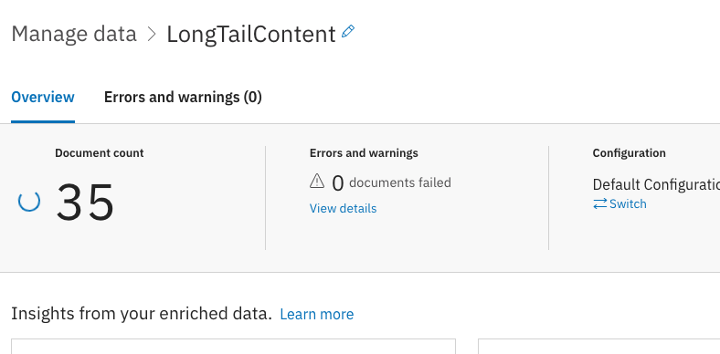

1.   Once all the content is uploaded (the progress indicator next to document count disappears), feel free to run searches on the indexed content. **Click on the Build Queries** icon on the left side of the page.  

      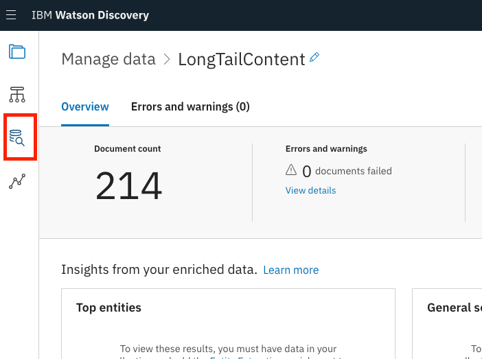

1.   **Click on the 'Search for documents'** section.  

      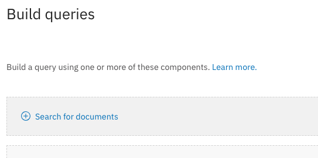

1.   Enter a sample query / question (i.e "tire pressure") as a natural langauge query. Discovery will search the indexed content for results. On the right hand panel, you can see the top results, as well as passages (smaller excerpts from the content) that are relevant to the query.

      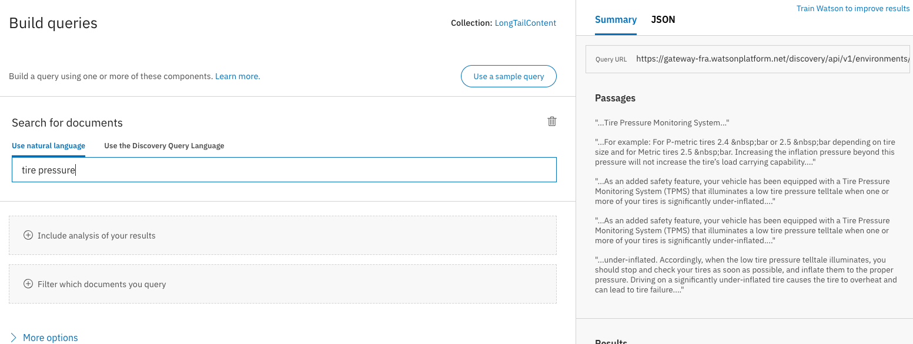


## Part 3: Edit the application

### Add IBM Watson Discovery service credentials to .env file

1.  To find the Watson Discovery service credentials: from the IBM cloud console, click on the Watson Discovery service instance you created and click on **Service credentials** on the left of the page and then the 'View credentials' drop down. You will need to copy the two fields 'apikey' and 'url' into the `.env` file. The Watson SDK automatically locates the correct environment variables for the `apikey` and `url` credentials.

    ```
    DISCOVERY_IAM_APIKEY=caXXXXXXXXXXXXXXXXX
    DISCOVERY_URL=https://gateway.watsonplatform.net/assistant/api
    ```

    Save the `.env` file

1.  To interact with the collection we created, you will need to gather a couple of unique identifiers (an environment ID and a collection ID).  You can find these IDs from the Watson Discovery tooling. From the desired collection landing page, **Click on the 'Use this collection in API'** link on the 'Collection Info' section of the page.

    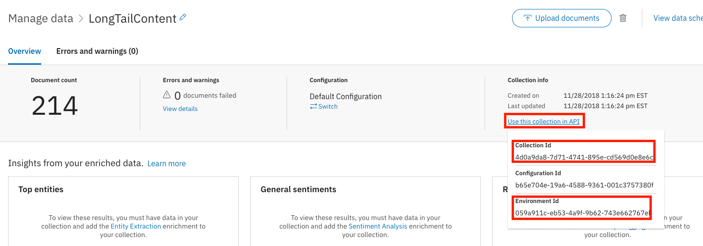  

    Copy the **Collection Id** and **Environment Id** value from this page and add the ids to the .env file as shown:

    ```
    DISCOVERY_COLLECTION_ID=4d0aXXXXXXXXXXXXXXXXXXX
    DISCOVERY_ENVIRONMENT_ID=059XXXXXXXXXXXXXXXXXXX
    ```

    Save the `.env` file

### Add the code
1. Open the `app.js` file and scroll down until you see

```
      /////////////////////////////////////////////
      // UNCOMMENT THESE LINES TO CALL DISCOVERY //
      /////////////////////////////////////////////
      // if (outaction.indexOf(call_discovery_flag_name) > -1) {
      //   return callDiscovery(data, res, payload);
      // } else {
        return res.json(data);
      // }
```
Uncomment the 4 lines total to add the logic to call discovery upon finding the flag in the response from Watson Assistant

## Part 4: Retest the Application

1.  Use the same commands as before to re-run the application with your code changes.
#### Using Node

```
npm start
```

#### Using Docker

```bash
docker run -it --rm -v "$(pwd):/repo" -p 3000:3000 timrodocker/mydev bash
cd repo
```

2.  View the application in a browser at `localhost:3000` and interact with the chatbot.

This time when you ask the question "checking tire pressure". You should see the response from Watson Discovery.

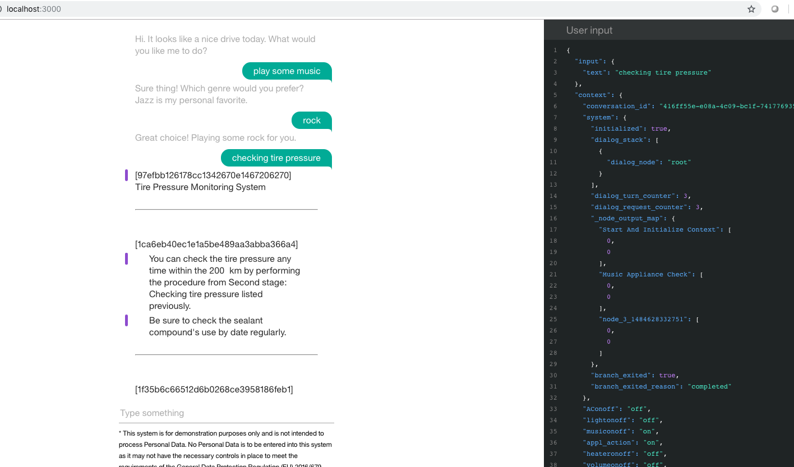  


### Running on IBM Cloud
You could also deploy the application to to IBM Cloud as a Cloud Foundry Application

1.  Using a text editor update the *manifest.yml* file. Change the **name** field to something unique. For example, `- name: my-app-name`.

2.  Open a terminal and navigate to the `assistant-with-discovery-lab` directory. **Optionally**, if you do not have node installed and/or prefer to use docker. Use the following command to start a developer container with the bash prompt and then change the directory in the container into the repository.

    ```bash
    docker run -it --rm -v "$(pwd):/repo" -p 5000:5000 timrodocker/mydev bash
    cd repo
    ```
3.  Login to IBM Cloud with the [IBM Cloud CLI](https://console.bluemix.net/docs/cli/index.html#overview): `ibmcloud login`
4.  Target a Cloud Foundry organization and space: `ibmcloud target --cf`
5.  Deploy the application using `ibmcloud app push`
6.  View the application online at the app URL (found on your IBM Cloud console).

If the deployment fails, due to a service name not found issue, you could
* Change the names of your IBM Cloud services to match the names in the manifest.
* Change the names in the manifest to match the names of your IBM Cloud services.

## [OPTIONAL] Part 5: Call Discovery with Cloud Functions

Another approach to integrate the Watson Discovery service is to use cloud functions allowing the Watson Assistant dialog to call Watson Discovery directly (instead of the client application). As an optional exercise, run the steps in the [Discovery Cloud Functions Readme](DiscoveryCloudFunction.md).

# License

This sample code is licensed under Apache 2.0.  
Full license text is available in [LICENSE](LICENSE).

# Links

* [IBM Watson Assistant Docs](https://console.bluemix.net/docs/services/conversation/dialog-build.html#dialog-build)
* [Blog for IBM Watson Assistant Slots Code Pattern](https://developer.ibm.com/code/2017/09/19/managing-resources-efficiently-watson-conversation-slots/)
* [Tutorial - Deploy a chatbot on IBM Cloud Kubernetes](https://developer.ibm.com/tutorials/set-up-your-own-instance-of-a-chatbot-and-deploy-it-to-the-kubernetes-environment-on-ibm-cloud/?social_post=1872588192&fst=Learn)

# Learn more

* **Artificial Intelligence Code Patterns**: Enjoyed this Code Pattern? Check out our other [AI Code Patterns](https://developer.ibm.com/code/technologies/artificial-intelligence/).
* **AI and Data Code Pattern Playlist**: Bookmark our [playlist](https://www.youtube.com/playlist?list=PLzUbsvIyrNfknNewObx5N7uGZ5FKH0Fde) with all of our Code Pattern videos
* **With Watson**: Want to take your Watson app to the next level? Looking to utilize Watson Brand assets? [Join the With Watson program](https://www.ibm.com/watson/with-watson/) to leverage exclusive brand, marketing, and tech resources to amplify and accelerate your Watson embedded commercial solution.
* **Kubernetes on IBM Cloud**: Deliver your apps with the combined the power of [Kubernetes and Docker on IBM Cloud](https://www.ibm.com/cloud-computing/bluemix/containers)
